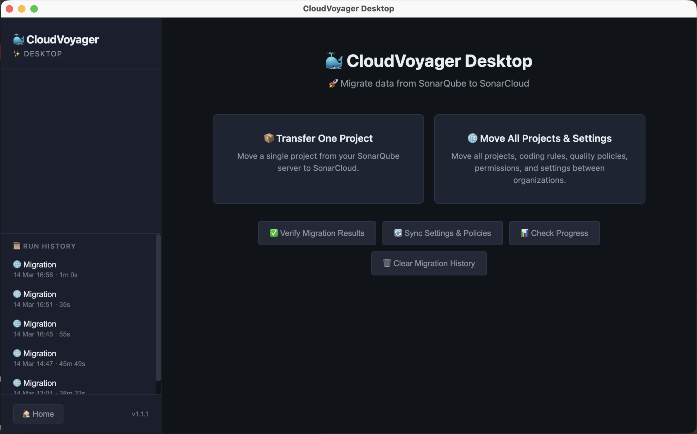

# ☁️ 🐋 CloudVoyager

<!-- Last updated: 2026-03-20 -->

Migrate your data from self-hosted SonarQube to SonarCloud — no re-scanning needed. This was done by reverse-engineering SonarScanner (scan report protobuf files) & then fully rebuilding everything from the ground up on Node.js.

CloudVoyager copies everything — projects, code issues, security hotspots, quality gates, quality profiles, permissions, and more — directly from SonarQube into SonarCloud. It is available as both a CLI tool and a Desktop app with a guided wizard interface.

<!-- Updated: 2026-02-19 -->
## ✅ Quick Start (Recommended)

**Choose your scenario:**

| 🤔 Scenario | Click Below ⤵️ |
|----------|-------|
| Migrate **one project** from SonarQube to SonarCloud | [Single Project Migration](docs/scenario-single-project.md) |
| Migrate **everything** from SonarQube to **one** SonarCloud org | [Full Migration — Single Org](docs/scenario-single-org.md) |
| Migrate **everything** from SonarQube to **multiple** SonarCloud orgs | [Full Migration — Multiple Orgs](docs/scenario-multi-org.md) |

## 🖥️ Desktop App (New!)

Prefer a visual interface? **CloudVoyager Desktop** provides a guided wizard UI — no terminal or config files needed. Includes a **Run History** sidebar for quick access to past migration results.



| Platform | Download |
|----------|----------|
| Linux (x64) | `.AppImage` |
| Linux (ARM64) | `.AppImage` |
| macOS (Apple Silicon) | `.dmg` |
| macOS (Intel) | `.dmg` |
| Windows (x64) | `.exe` installer |
| Windows (ARM64) | `.exe` installer |

Download the latest version from the [releases page](https://github.com/sonar-solutions/cloudvoyager/releases).

**NEXT, PLEASE DO THE BELOW**: 
If you want to be able to open this on MacOS, you **MUST DO THE FOLLOWING** for it to work:
- Open your Terminal and unblock permissions by running this command: `xattr -cr "CloudVoyager Desktop.app"`.
- Or if that does not work, older versions use an older command `xattr -c /Applications/CloudVoyager\ Desktop.app`
- This only happens for MacOS due to MacOS in-built Gatekeeper permissions. After running the command above, you should be able to run CloudVoyager Desktop.
- For Windows and Linux users, you will not face this issue.

See the [Desktop App Guide](docs/desktop-app.md) for setup instructions and a walkthrough of the wizard.

<!-- Updated: 2026-02-18 -->
## 🔥 Single Command Full Migration (Slightly Dangerous)

1. Download the latest release of CloudVoyager from the [releases page](https://github.com/sonar-solutions/cloudvoyager/releases).
2. Ensure that you have full admin access API tokens for your SonarQube server and your SonarCloud organization.
3. Create the `migrate-config.json` file with the required information (see the [full migration docs](docs/scenario-single-org.md) for details).
4. Run the following command in your terminal:
```bash
./cloudvoyager migrate -c migrate-config.json --verbose --auto-tune
```
5. Once the migration finishes, review the `./migration-output` directory for any errors or warnings.
6. Run the verification command to confirm everything was migrated correctly:
```bash
./cloudvoyager verify -c migrate-config.json --verbose
```

<!-- Updated: 2026-03-10 -->
## 🔄 Pause and Resume

All migrations support **automatic checkpointing**. Progress is saved after every phase (extract, build, encode, upload). If a migration is interrupted — whether by CTRL+C (graceful shutdown), a crash, or a network failure — simply re-run the same command to resume from where it left off. No data is lost or duplicated.

A **lock file** prevents concurrent runs against the same project, so you cannot accidentally start two migrations at once.

```bash
# Transfer was interrupted — just re-run to resume
./cloudvoyager transfer -c config.json --verbose

# Check progress without running
./cloudvoyager transfer -c config.json --show-progress

# Discard checkpoint and start the migration from scratch
./cloudvoyager transfer -c config.json --force-restart

# Re-extract data from SonarQube but keep other cached phases
./cloudvoyager transfer -c config.json --force-fresh-extract

# Clear a stale lock file (e.g. after a hard crash)
./cloudvoyager transfer -c config.json --force-unlock
```

See the [Configuration Reference](docs/configuration.md#checkpoint-settings) for checkpoint options (`transfer.checkpoint`).

<!-- Updated: 2026-03-19 -->
## 🔄 SonarQube Version Compatibility

CloudVoyager ships **four fully independent pipelines** — one per SonarQube version range. At runtime, `version-router.js` calls `/api/system/status`, detects the server version, and dynamically loads the matching pipeline. No special configuration is needed.

| SonarQube Version | Pipeline | Issue Search Param | MetricKeys | Clean Code Source | Groups API |
|-------------------|----------|-------------------|------------|-------------------|------------|
| **9.9 LTS** | `sq-9.9` | `statuses` | Batched (15) | SC enrichment map | Standard |
| **10.0 – 10.3** | `sq-10.0` | `statuses` | Batched (15) | Native from SQ | Standard |
| **10.4 – 10.8** | `sq-10.4` | `issueStatuses` | Batched (15) | Native from SQ | Standard |
| **2025.1+** | `sq-2025` | `issueStatuses` | No batching | Native from SQ | Web API V2 fallback |

Each pipeline folder (`src/pipelines/sq-*`) contains its own SonarQube client, SonarCloud client, protobuf builder, and transfer/migrate logic — no runtime version checks or `if/else` branches.

See [Backward Compatibility](docs/backward-compatibility.md) for technical details on how version differences are handled.

<!-- Updated: 2026-02-19 -->
## 🛠️ Local Development

Want to build and test CloudVoyager locally? See the [Local Development Guide](docs/local-development.md) for step-by-step instructions.

<!-- Updated: 2026-02-25 -->
## 📚 Documentation

| Document | Description |
|----------|-------------|
| [Key Capabilities](docs/key-capabilities.md) | Comprehensive overview of engineering, architecture, and capabilities |
| [Architecture](docs/architecture.md) | Project structure, data flow, and report format |
| [Configuration Reference](docs/configuration.md) | All config options, environment variables, and npm scripts |
| [Technical Details](docs/technical-details.md) | Protobuf encoding, measure types, concurrency model |
| [Troubleshooting](docs/troubleshooting.md) | Common errors and how to fix them |
| [Dry-Run CSV Reference](docs/dry-run-csv-reference.md) | CSV schema documentation for the dry-run workflow (including user mapping) |
| [Backward Compatibility](docs/backward-compatibility.md) | SonarQube version support (9.9 LTS through 2025.1+) |
| [Desktop App Guide](docs/desktop-app.md) | Installation, wizard walkthrough, and building from source |
| [Verification](docs/verification.md) | Migration verification checks, pass/fail criteria, and report formats |
| [Pseudocode Explanation](docs/pseudocode-explanation.md) | Every feature documented in pseudocode for technical review |
| [Contributing](CONTRIBUTING.md) | Architectural patterns, conventions, and contribution guidelines |
| [Changelog](docs/CHANGELOG.md) | Release history and notable changes |

<!-- Updated: 2026-02-17 -->
## 📝 License

MIT

<!--
## Change Log
| Date | Section | Change |
|------|---------|--------|
| 2026-02-28 | Single Command Migration | Added verify step |
| 2026-02-19 | Quick Start, Local Dev | Links to scenario and local dev docs |
| 2026-02-18 | Single Command Migration | Migrate command with --auto-tune |
| 2026-02-17 | License | MIT license added |
| 2026-02-16 | All | Initial README |
-->
