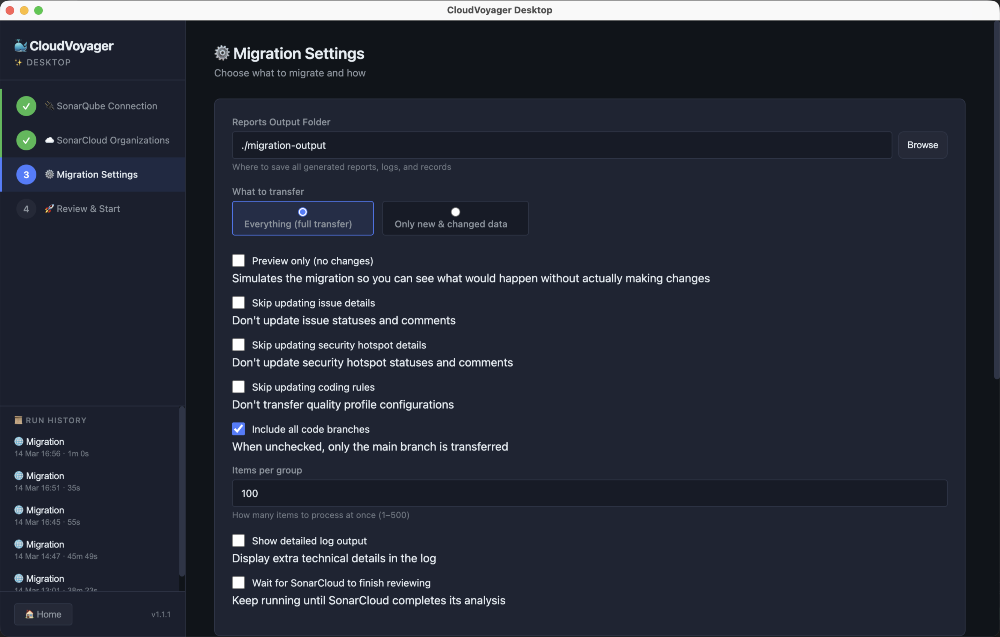
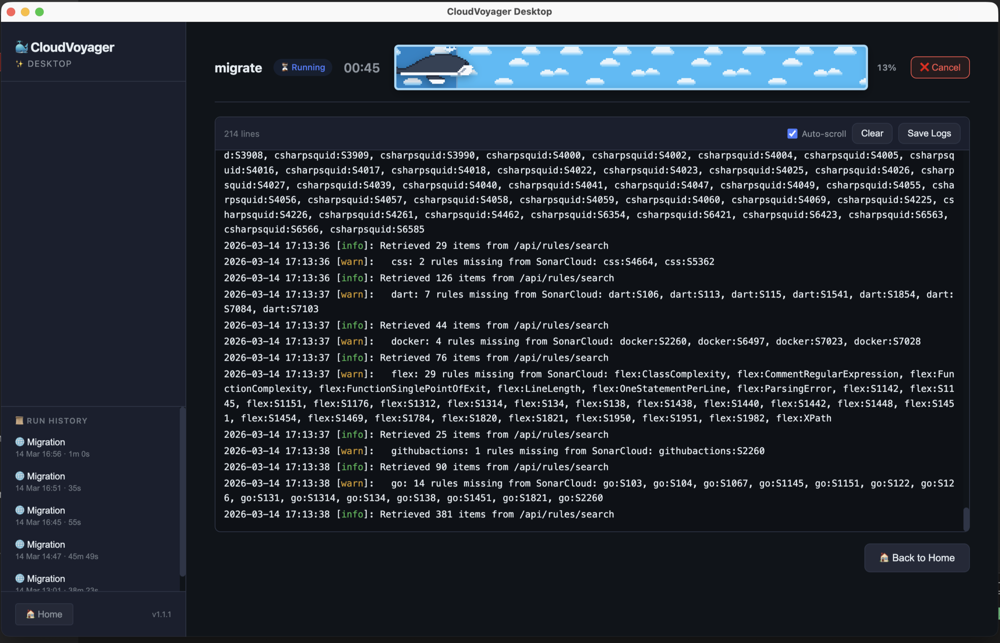
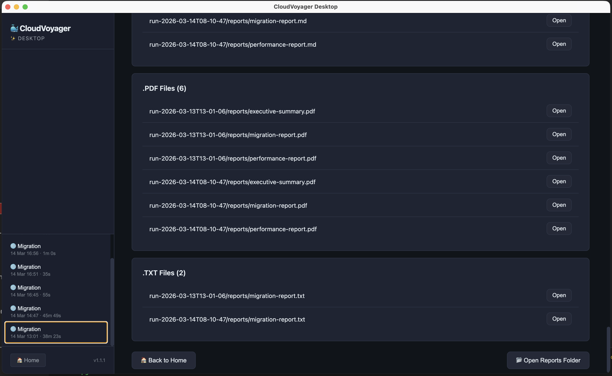

# Desktop App

<!-- Updated: Mar 26, 2026 -->

CloudVoyager Desktop wraps the CLI binary in a guided wizard UI built with Electron. No terminal needed — fill in forms, click Start, and watch live logs stream in real-time. All configuration persists between app restarts with encrypted token storage.


Available for: **Linux x64**, **Linux ARM64**, **macOS ARM64**, **macOS x64**, **Windows x64**, **Windows ARM64**.

## Installation

Download the latest release from the [GitHub Releases](https://github.com/your-org/cloudvoyager/releases) page. Choose the installer for your platform:

| Platform | Format | File |
|----------|--------|------|
| Linux x64 | AppImage | `CloudVoyager-x.x.x-linux-x86_64.AppImage` |
| Linux ARM64 | AppImage | `CloudVoyager-x.x.x-linux-arm64.AppImage` |
| macOS ARM64 | DMG | `CloudVoyager-x.x.x-mac-arm64.dmg` |
| macOS x64 | DMG | `CloudVoyager-x.x.x-mac-x64.dmg` |
| Windows x64 | NSIS Installer | `CloudVoyager-x.x.x-win-x64-setup.exe` |
| Windows ARM64 | NSIS Installer | `CloudVoyager-x.x.x-win-arm64-setup.exe` |

> The app bundles the CLI binary — no separate CLI install is needed.

## Getting Started

### Welcome Screen

On launch, the Welcome screen presents the available workflows:

- **Transfer One Project** — Migrate a single project from SonarQube to SonarCloud
- **Move All Projects & Settings** — Full organization migration (projects, quality gates, profiles, permissions, etc.)
- **Verify Migration Results** — Compare data between source and destination after migration
- **Sync Settings & Policies** — Update coding rules, policies, and permissions without re-migrating code data
- **Check Progress** — View migration progress and state
- **Clear Migration History** — Reset state and clear sync history

### Wizard Flow

Each workflow guides you through a series of screens:

1. **Connection setup** — Enter SonarQube and SonarCloud URLs and tokens
2. **Options** — Configure transfer mode, branch selection, and other settings
3. **Review** — Confirm all settings before starting
4. **Start** — Kick off the migration and watch live logs

The live log viewer shows migration progress in real-time with a timer, cancel button, and status badge. When complete, the results screen shows generated report files that you can browse and open.

## Wizard Screens

### Transfer Config (4 steps)

| Step | Description |
|------|-------------|
| 1. SonarQube Connection | Enter URL and token for the source SonarQube instance |
| 2. SonarCloud Connection | Enter URL, token, organization, and project key for the target |
| 3. Transfer Settings | Choose transfer mode (full/incremental), batch size, branch options |
| 4. Review & Start | Review all settings and begin the transfer |

### Migrate Config (4 steps)

| Step | Description |
|------|-------------|
| 1. SonarQube Connection | Enter URL and admin token for the source SonarQube instance |
| 2. SonarCloud Organizations | Add or remove target SonarCloud organizations with their tokens |
| 3. Migration Settings | Configure output directory, dry run, included/excluded projects. The "Choose What to Migrate" and "More Settings (Advanced)" sections are collapsed by default to reduce clutter (click the shield or gear icon to expand) |
| 4. Review & Start | Review all settings and begin the full migration |



### Verify Config (3 steps)

| Step | Description |
|------|-------------|
| 1. SonarQube Connection | Enter URL and token for the source SonarQube instance |
| 2. SonarCloud Organizations | Add target SonarCloud organizations to verify against |
| 3. Review & Start | Review settings and begin verification |

### Sync Metadata Config (3 steps)

| Step | Description |
|------|-------------|
| 1. SonarQube Connection | Enter URL and token for the source SonarQube instance |
| 2. SonarCloud Organizations | Add target SonarCloud organizations for metadata sync |
| 3. Review & Start | Review settings and begin metadata synchronization |

### Other Screens

- **Connection Test** — Runs the `test` command to verify connectivity to both SonarQube and SonarCloud
- **Execution** — Live log viewer with elapsed timer, cancel button, and status badge (running/success/failed)



- **Results** — Browse and open generated report files from the migration output directory



- **Run History** (sidebar) — Lists past successful migration and transfer runs in the sidebar. Click any entry to view its reports. History persists across app restarts (max 50 entries).
- **Status** — View migration progress, sync history, and reset state

### Progress Tracking and Animation

The execution screen includes real-time progress tracking with a whale animation:

- **Progress Parser** (`progress-parser.js`) — Parses CLI log lines to compute progress percentages and ETA for all pipeline types (migrate, transfer, verify). Uses pattern matching on log output to track extraction steps, per-project phases, and sub-operations.
- **Whale Animator** (`whale-animator.js`) — Pixel-art whale sprite that moves across the screen as progress advances. Includes a twinkling starfield, cloud parallax, and typewriter phase labels. Supports dark/light themes.

The progress bar layout divides 0-100% across pipeline phases (e.g., for migrate: 0-10% setup, 10-15% org config, 15-95% per-project migration, 95-100% finalization).

## Configuration Persistence

- All settings are saved automatically as you navigate between wizard steps
- Tokens are encrypted at rest using `electron-store`
- Two config schemas are maintained: `transferConfig` and `migrateConfig`
- Window size and position are remembered across restarts
- Migration run history (last 50 entries) is stored for quick access to past reports
- Theme preference (dark/light/system) is persisted
- Config is stored in the platform-specific user data directory:

| Platform | Location |
|----------|----------|
| Linux | `~/.config/cloudvoyager-desktop/` |
| macOS | `~/Library/Application Support/cloudvoyager-desktop/` |
| Windows | `%APPDATA%\cloudvoyager-desktop\` |

## Building from Source

### Prerequisites

- Node.js v20+
- The CLI binary placed in `desktop/resources/cli/` (use `node scripts/prepare-cli.js` to copy from `dist/bin/`)

### Development

```bash
cd desktop
npm install
npm start          # Run in dev mode (uses src/index.js as CLI fallback)
```

Pass `--dev` to enable DevTools on startup.

### Distribution Builds

```bash
npm run build:linux-x64
npm run build:linux-arm64
npm run build:mac-arm64
npm run build:mac-x64
npm run build:win-x64
npm run build:win-arm64
```

Output artifacts are placed in the `desktop/dist/` directory.

## Architecture

The desktop app lives in the `desktop/` directory at the repository root. It is built with **Electron 33.4.11** and vanilla HTML/CSS/JS — no frontend frameworks.

```
desktop/
├── package.json
├── electron-builder.yml
├── scripts/prepare-cli.js
├── src/
│   ├── main/
│   │   ├── main.js            # Electron main process, single-instance lock,
│   │   │                      # window bounds persistence, F6 screenshot,
│   │   │                      # --dev flag, OS theme detection
│   │   ├── cli-runner.js      # CLI binary spawner with platform detection
│   │   ├── ipc-handlers.js    # 10 IPC channels (config, cli, dialog, reports, devtools, app)
│   │   └── config-store.js    # electron-store with encryption, two config schemas
│   ├── preload/
│   │   └── preload.js         # contextBridge → window.cloudvoyager namespace
│   │                          # (7 modules: config, cli, dialog, reports, app, theme, devtools)
│   └── renderer/
│       ├── index.html
│       ├── styles/
│       │   ├── main.css       # 500+ lines: dark/light theme vars, glassmorphism,
│       │   │                  # scanline overlay, ambient gradients
│       │   └── wizard.css
│       └── js/
│           ├── app.js         # window.App global, 9 screens, theme manager,
│           │                  # toast notifications (6s auto-dismiss), confirm dialogs
│           ├── screens/
│           │   ├── welcome.js
│           │   ├── transfer-config.js    # 4-step wizard
│           │   ├── migrate-config.js     # 4-step wizard
│           │   ├── verify-config.js      # 3-step wizard
│           │   ├── sync-metadata-config.js  # 3-step wizard
│           │   ├── connection-test.js
│           │   ├── execution.js
│           │   ├── results.js
│           │   └── status.js
│           └── components/
│               ├── config-form.js      # Reusable form builders with XSS prevention
│               ├── log-viewer.js       # 50k line buffer, ANSI-to-HTML, search/filter
│               ├── migration-graph.js  # Canvas DAG with force simulation, node color
│               │                       # transitions, particle effects
│               ├── wizard-nav.js       # Step indicator component
│               ├── sidebar-history.js  # 50-entry run history
│               ├── progress-parser.js # CLI log progress parsing and ETA
│               └── whale-animator.js  # Pixel-art whale animation with starfield
└── assets/                             # App icons
```

### Main Process

- **main.js**: Enforces single-instance lock so only one app window runs at a time. Persists window bounds across restarts. Registers `F6` as a global shortcut to capture screenshots. Passes `--dev` to open DevTools on startup. Detects OS theme for light/dark mode.
- **ipc-handlers.js**: Registers 10 IPC channels under namespaces `config:*`, `cli:run`, `cli:cancel`, `dialog:*`, `reports:*`, `devtools:capture`, and `app:*`.
- **cli-runner.js**: Detects the platform-specific CLI binary (`cloudvoyager-{platform}-{arch}`). Spawns the binary as a child process with line-buffered stdout/stderr for live log streaming. Writes temporary config files with mode `0o600` for security. Implements graceful shutdown: sends `SIGTERM`, then `SIGKILL` after 5 seconds on Unix; uses `taskkill` on Windows.
- **config-store.js**: Wraps `electron-store` with encryption enabled. Maintains two config schemas (`transferConfig` and `migrateConfig`), a 50-entry migration history, and theme preference.

### Preload Bridge

**preload.js** exposes the `window.cloudvoyager` namespace to the renderer via `contextBridge`. It provides 7 modules: `config`, `cli`, `dialog`, `reports`, `app`, `theme`, and `devtools`. All renderer-to-main communication goes through this bridge.

### Renderer

- **app.js**: Defines the `window.App` global, manages 9 screens, handles theme switching, and provides toast notifications (6-second auto-dismiss) and confirm dialogs with focus traps.
- **Screens**: Each wizard screen manages its own step navigation and form state. Transfer and migrate configs use 4-step wizards; verify and sync-metadata use 3-step wizards.
- **Components**:
  - `config-form.js` — Reusable form field builders with built-in XSS prevention (HTML escaping)
  - `log-viewer.js` — Displays up to 50,000 log lines with ANSI-to-HTML color conversion, search, and filter
  - `migration-graph.js` — Canvas-based DAG visualization with force-directed layout, animated node color transitions, and particle effects for active phases
  - `wizard-nav.js` — Step indicator showing current position in the wizard flow
  - `sidebar-history.js` — Displays the last 50 migration/transfer runs with clickable entries to view reports

### Security

- **Context isolation** enabled; `nodeIntegration` disabled. Sandbox is disabled to allow CLI binary spawning.
- **CSP headers** configured to restrict content sources.
- **Path traversal guards** on file read operations.
- **HTML escaping** in all user-facing content to prevent XSS.
- **Password masking** for token input fields.
- **Temporary config files** written with `0o600` permissions and auto-cleaned after CLI execution.

### Accessibility

- ARIA labels, roles, and live regions throughout the UI
- Focus management and keyboard navigation support
- Screen reader compatibility
- Focus traps in confirm dialogs

### Data Flow (Transfer Example)

1. User fills the 4-step wizard — config is saved to `electron-store` at each step
2. `cli:run` IPC message sent to main process — main writes a temp config file, spawns the CLI binary
3. CLI stdout/stderr piped through `readline` — each line sent back as `cli:log` IPC events
4. `LogViewer` accumulates lines with ANSI rendering; `MigrationGraph` parses phase keywords to animate the DAG
5. Process exit triggers `cli:exit` IPC — renderer transitions to the results screen
6. History entry saved to `electron-store`; temp config file auto-cleaned

### Key Design Decisions

- **Electron 33.4.11** with vanilla HTML/CSS/JS — no framework dependency
- **`contextBridge` / IPC** for secure renderer-to-main communication
- **`electron-store`** for encrypted config persistence with two separate schemas
- **`electron-builder`** for cross-platform packaging
- **Child process spawning** — the CLI binary runs as a subprocess with line-buffered stdout/stderr for live streaming
- **Dark/light/system theme** support with OS theme detection and user override
- **Default window size** of 1400x850 for comfortable log viewing
- **Visual effects**: glassmorphism panels, scanline overlay, ambient gradients, typing animations, staggered card entrance, whale progress indicator

## CLI vs Desktop Feature Comparison

Both the CLI and Desktop app provide the same migration capabilities. The Desktop app adds a graphical wrapper with guided wizards and encrypted storage.

| Feature | CLI | Desktop |
|---------|-----|---------|
| Transfer single project | Yes | Yes |
| Full org migration | Yes | Yes |
| Verify migration | Yes | Yes |
| Sync metadata | Yes | Yes |
| Live log output | Terminal | Built-in log viewer (50k line buffer, ANSI colors, search) |
| Config format | JSON file | Guided wizard with step-by-step forms |
| Encrypted token storage | No | Yes (electron-store) |
| Run history | No | Yes (last 50 runs in sidebar) |
| Migration visualization | No | Yes (Canvas DAG with animated phases) |
| Theme support | N/A | Dark / Light / System |
| Platform support | 6 platforms | 6 platforms |
