# 🔬 Technical Details

<!-- Last updated: Apr 18, 2026 (issue sync pre-filter optimization, SC indexing wait, SonarCloud 10K issue slicing, githubactions language support, SQC US instance, enterprise key optional, search-slicer for SQC, fallback rule repositories, protobuf details, external issues, enum values, error hierarchy, state management, API gotchas, CE retry, issue status mapping, checkpoint extraction, CSV filtering) -->

<!-- Updated: Apr 18, 2026 -->
## 🗺️ Main Flow Sequence Diagram

The diagram below shows the high-level flows for the four main commands. The **➕** markers reference the drill-down prompts in the table that follows — paste any prompt into a new chat (with this codebase in context) to generate a detailed diagram for that subsystem.

```mermaid
sequenceDiagram
    autonumber
    actor User
    participant CLI as CLI (src/index.js)
    participant VR as VersionRouter
    participant SQ as SonarQube
    participant SC as SonarCloud
    participant FS as File System

    rect rgb(30, 50, 80)
        Note over User,FS: transfer command
        User->>CLI: cloudvoyager transfer -c config.json
        CLI->>VR: GET /api/system/status
        VR-->>CLI: pipeline = sq-{version}
        CLI->>FS: acquire lock + load checkpoint journal
        CLI->>SQ: test connection
        CLI->>SC: test connection

        Note over CLI,SQ: ➕A  Extract — 13 phases, checkpoint-guarded
        CLI->>SQ: extract metadata / components / rules / issues
        CLI->>SQ: extract hotspots / measures / sources / duplications
        CLI->>SQ: extract changesets / symbols / syntax highlighting
        SQ-->>CLI: extracted data (gzipped cache per phase)

        Note over CLI: ➕B  Build & encode protobuf report
        CLI->>CLI: build Issue / ExternalIssue / AdHocRule messages
        CLI->>CLI: build Measure / Component / Changeset messages
        CLI->>CLI: zip → scanner-report.zip

        Note over CLI,SC: ➕C  Upload & CE retry
        CLI->>SC: POST /api/ce/submit (scanner-report.zip)
        SC-->>CLI: CE task ID (or timeout → poll /api/ce/activity)

        Note over CLI,SC: ➕D  Issue & hotspot metadata sync
        CLI->>SQ: fetch issues + changelogs (sliced for >10K)
        CLI->>CLI: applyManualChangesPreFilter
        CLI->>SC: waitForScIndexing (retry if SC not yet indexed)
        CLI->>SC: match + replay transitions / assignee / comments / tags
        CLI->>SC: sync hotspot statuses + comments

        CLI->>FS: release lock + update state file
        CLI-->>User: Transfer complete
    end

    rect rgb(30, 60, 50)
        Note over User,FS: migrate command
        User->>CLI: cloudvoyager migrate -c migrate-config.json
        CLI->>VR: GET /api/system/status
        VR-->>CLI: pipeline = sq-{version}
        CLI->>SQ: extract projects / gates / profiles / groups
        CLI->>SQ: extract permissions / templates / portfolios / webhooks
        SQ-->>CLI: server-wide data (parallel Promise.all)

        Note over CLI,FS: ➕E  Org mapping + dry-run CSVs
        CLI->>CLI: map projects → orgs by DevOps binding
        CLI->>FS: write 9 CSV types + server info JSON
        CLI->>FS: load / create MigrationJournal

        loop For each org (concurrent)
            CLI->>SC: create groups + global permissions
            CLI->>SC: create quality gates
            Note over CLI,SC: ➕F  Quality profile migration
            CLI->>SC: restore profiles + write quality-profile-diff.json
            CLI->>SC: create permission templates

            loop For each project
                CLI->>CLI: resolve project key
                Note over CLI: run transfer pipeline (➕A–D)
                CLI->>SC: set settings / tags / links / new-code periods
                CLI->>SC: set DevOps binding / gate / profiles / permissions
                CLI->>FS: mark project done in MigrationJournal
            end

            CLI->>SC: create portfolios + assign projects
        end

        CLI->>FS: write migration reports (JSON + MD + PDF)
        CLI-->>User: Migration complete
    end

    rect rgb(60, 40, 70)
        Note over User,FS: verify command
        User->>CLI: cloudvoyager verify -c migrate-config.json
        CLI->>SQ: fetch projects + build org mappings

        loop For each org
            CLI->>SC: verify gates / profiles / groups / permissions
            loop For each project
                CLI->>SQ: fetch issues / hotspots / measures / branches
                CLI->>SC: fetch same data
                CLI->>CLI: diff by rule+file+line, statuses, assignments
                CLI->>CLI: diff measures / branches / settings / permissions
            end
        end

        CLI->>FS: write verification reports (JSON + MD + PDF)
        CLI-->>User: Verification complete
    end

    rect rgb(60, 50, 30)
        Note over User,FS: sync-metadata command
        User->>CLI: cloudvoyager sync-metadata -c migrate-config.json
        CLI->>VR: GET /api/system/status
        VR-->>CLI: pipeline = sq-{version}

        loop For each org → each project
            CLI->>SQ: fetch issues + changelogs (sliced for >10K)
            CLI->>CLI: applyManualChangesPreFilter
            CLI->>SC: waitForScIndexing (retry if 0 results)
            CLI->>SC: replay transitions / assignees / comments / tags
            CLI->>SC: sync hotspot statuses + comments
        end

        CLI-->>User: Metadata sync complete
    end
```



**Drill-down prompts** — paste into a new chat with this repo in context:

| # | Subsystem | Prompt |
|---|-----------|--------|
| ➕A | Extraction pipeline | `Generate a mermaid sequence diagram showing the 13-phase checkpoint-aware extraction pipeline in CloudVoyager in detail` |
| ➕B | Protobuf encoding | `Generate a mermaid sequence diagram showing how CloudVoyager builds and encodes a scanner report ZIP using protobuf messages` |
| ➕C | CE submission retry | `Generate a mermaid sequence diagram showing the CE submission retry mechanism in CloudVoyager including fallback polling` |
| ➕D | Issue sync | `Generate a mermaid sequence diagram showing the full issue sync pipeline in CloudVoyager including pre-filter, SC indexing wait, and changelog replay` |
| ➕E | Org mapping / CSVs | `Generate a mermaid sequence diagram showing how CloudVoyager maps SonarQube projects to SonarCloud organizations and generates dry-run CSV files` |
| ➕F | Quality profiles | `Generate a mermaid sequence diagram for CloudVoyager quality profile migration including backup XML, rename of built-in profiles, and diff report` |

<!-- Updated: Mar 25, 2026 -->
## 📡 Protobuf Encoding

The scanner report uses `scanner-report.proto` and `constants.proto` (in each pipeline's `protobuf/schema/` directory). Key protobuf messages: `Metadata`, `Component`, `Issue`, `ExternalIssue`, `AdHocRule`, `Measure`, `ActiveRule`, `Duplication`, `Changesets`, `Symbols`, `SyntaxHighlighting`, `LineCoverage`.

### Encoding Styles

The scanner report ZIP uses two encoding styles:
- **Single message** (no length delimiter): `metadata.pb`, `component-{ref}.pb`, `changesets-{ref}.pb`
- **Length-delimited** (multiple messages): `issues-{ref}.pb`, `measures-{ref}.pb`, `activerules.pb`, `external-issues-{ref}.pb`, `adhocrules.pb`, `duplications-{ref}.pb`
- **Plain text**: `source-{ref}.txt` (source code)
- **Empty sentinel**: `context-props.pb` (always empty, matches real scanner behavior)

### Report ZIP Structure

```
metadata.pb                       # Single Metadata message (NOT length-delimited)
component-{ref}.pb                # One per component (NOT length-delimited)
issues-{ref}.pb                   # Length-delimited Issue messages per component
measures-{ref}.pb                 # Length-delimited Measure messages per component
source-{ref}.txt                  # Plain text source code
activerules.pb                    # Length-delimited ActiveRule messages
changesets-{ref}.pb               # Single Changesets message per component
external-issues-{ref}.pb          # Length-delimited ExternalIssue per component
adhocrules.pb                     # Length-delimited AdHocRule messages
duplications-{ref}.pb             # Length-delimited Duplication messages per component
context-props.pb                  # Empty (matches real scanner)
```

<!-- Updated: Mar 25, 2026 -->
## 🔄 CE Submission Retry Mechanism

Report submission to SonarCloud's Compute Engine (`/api/ce/submit`) uses a robust retry strategy (implemented in `ce-submitter.js` within each pipeline):

1. **Submit** the report ZIP via `POST /api/ce/submit` with a 60-second response timeout
2. **On timeout** (no server response): fall back to `/api/ce/activity` polling — check for a matching CE task 5 times at 3-second intervals
3. **If no task found**: re-submit the report (second attempt)
4. **After second submission**: poll `/api/ce/activity` another 5 times
5. **If still no task**: throw a descriptive error with full mechanism details

The form data is buffered before sending (not streamed) to avoid runtime-specific issues with Bun's HTTP client. Branch characteristics (`branch=<name>`, `branchType=LONG`) are included for non-main branches.

### Key Enum Values

| Enum | Values |
|------|--------|
| **CleanCodeAttribute** | CONVENTIONAL=1, FORMATTED=2, IDENTIFIABLE=3, CLEAR=4, COMPLETE=5, EFFICIENT=6, LOGICAL=7, DISTINCT=8, FOCUSED=9, MODULAR=10, TESTED=11, LAWFUL=12, RESPECTFUL=13, TRUSTWORTHY=14 |
| **SoftwareQuality** | MAINTAINABILITY=1, RELIABILITY=2, SECURITY=3 |
| **ImpactSeverity** | LOW=1, MEDIUM=2, HIGH=3, INFO=4, BLOCKER=5 |
| **Severity** | UNSET=0, INFO=1, MINOR=2, MAJOR=3, CRITICAL=4, BLOCKER=5 |
| **IssueType** | CODE_SMELL=1, BUG=2, VULNERABILITY=3, SECURITY_HOTSPOT=4 |

**CRITICAL**: `cleanCodeAttribute` in `ExternalIssue` and `AdHocRule` must be encoded as a protobuf enum (varint), NOT a string. Despite the `.proto` file showing `optional string`, the real scanner uses enum encoding. SonarCloud CE silently ignores external issues if `cleanCodeAttribute` is string-encoded.

### Field Name Convention

protobufjs automatically converts snake_case field names to camelCase in JavaScript:
- `analysis_date` becomes `analysisDate`
- `scm_revision_id` becomes `scmRevisionId`
- `component_ref` becomes `componentRef`

All field names in the codebase use camelCase to match this convention.

<!-- Updated: Mar 25, 2026 -->
## 📏 Measure Type Mapping

Measures use typed value fields based on metric type:
- **Integer metrics** (`intValue`): `functions`, `statements`, `classes`, `ncloc`, `comment_lines`, `complexity`, `cognitive_complexity`, `violations`, `sqale_index`
- **String metrics** (`stringValue`): `executable_lines_data`, `ncloc_data`, `alert_status`
- **Float/percentage metrics** (`doubleValue`): `coverage`, `line_coverage`, `branch_coverage`, `duplicated_lines_density`, ratings

<!-- Updated: Mar 25, 2026 -->
## 📋 Active Rules

- Active rules are filtered by languages actually used in the project, resulting in ~84% reduction in payload size
- Rule keys are stripped of the repository prefix (e.g., `S7788` not `jsarchitecture:S7788`)
- Quality profile keys are mapped to SonarCloud profile keys (not SonarQube keys)

<!-- Updated: Mar 25, 2026 -->
## 🧱 Component Structure

Components use a flat structure - all files are direct children of the project component (no directory components). Line counts are derived from actual source file content rather than SonarQube measures API values.

<!-- Updated: Mar 25, 2026 -->
## 🔖 SCM Revision Tracking

The tool includes `scm_revision_id` (git commit hash) in metadata. SonarCloud uses this to detect and reject duplicate reports, enabling proper analysis history tracking.

<!-- Updated: Mar 25, 2026 -->
## 🌿 Branch Sync

By default, every branch discovered in SonarQube is transferred to SonarCloud (main branch first, then non-main branches). Each branch produces its own scanner report with branch-specific issues, measures, sources, and SCM data.

**Branch name resolution:** The main branch name is fetched from SonarCloud (via `getMainBranchName()` API) rather than using the SonarQube branch name. This avoids mismatches where SonarQube uses "main" but SonarCloud expects "master" (or vice versa). Non-main branches use their original SonarQube branch name and reference the main branch for new-code comparison.

**Incremental mode:** Completed branches are tracked in the state file. On subsequent runs, already-synced branches are skipped automatically. Use `reset` to re-transfer all branches.

**Configuration:** Set `transfer.syncAllBranches` to `false` to only sync the main branch. Use `transfer.excludeBranches` to skip specific branch names (e.g., `["feature/old", "release/v1"]`).

<!-- Updated: Mar 25, 2026 -->
## 📄 API Pagination

SonarQube client handles pagination automatically via `getPaginated` method with a default page size of 500 items. All paginated results are concatenated into single arrays.

**APIs with max `ps=100`** (not the default 500):
- `/api/permissions/groups`
- `/api/project_tags/search`
- `/api/qualityprofiles/search_users`
- `/api/qualityprofiles/search_groups`
- `/api/qualitygates/search_users`
- `/api/qualitygates/search_groups`

The extractors handle these lower limits automatically.

**metricKeys batching**: SQ 9.9 through 10.8 limits `metricKeys` to 15 per request (must batch). SQ 2025.1+ has no batching limit.

<!-- Updated: Apr 20, 2026 -->
## 📦 Issue Batching for Upload (5K Per Date Bucket)

SonarCloud's Elasticsearch caps **visualization** at 10,000 results per date bucket. When a branch has more than 5,000 issues, submitting them all in a single scanner report (with one `analysis_date`) means only 10K are visible — even though all issues exist in the database.

**Solution:** `src/shared/utils/batch-distributor/` splits large issue sets into batches of up to 5,000, each submitted as a separate scanner report with a distinct `analysis_date` going backwards from today.

### Algorithm

1. **Gate** — `should-batch.js`: if `extractedData.issues.length > 5000`, batching activates
2. **Plan** — `compute-batch-plan.js`: `batchCount = ceil(totalIssues / 5000)`, returns `[{startIndex, endIndex, batchIndex, isLast}]`
3. **Date** — `compute-batch-date.js`: last batch (newest) gets the original date; earlier batches are backdated one day each (`baseDate - (totalBatches - 1 - batchIndex)` days)
4. **Clone** — `create-batch-extracted-data.js`: shallow-clones `extractedData` with sliced `issues` array, overridden `metadata.extractedAt` and unique `metadata.scmRevisionId` (via `randomBytes(20)`)
5. **Trim** — Non-final batches strip `sources`, `changesets`, and `duplications` (set to `[]` / `new Map()`) to reduce upload size. `components` and `activeRules` are kept for issue resolution.
6. **Upload** — Each batch is built, encoded, and uploaded sequentially with `wait: true` (CE must complete before the next batch)

### Example

A branch with 20,590 issues on 2026-05-12:

| Batch | Issues | analysis_date | Submitted |
|-------|--------|---------------|-----------|
| 1/5 | 1–5,000 | 2026-05-08 | First (oldest) |
| 2/5 | 5,001–10,000 | 2026-05-09 | |
| 3/5 | 10,001–15,000 | 2026-05-10 | |
| 4/5 | 15,001–20,000 | 2026-05-11 | |
| 5/5 | 20,001–20,590 | 2026-05-12 | Last (newest, carries full project data) |

### Design Decisions

| Decision | Rationale |
|----------|-----------|
| Batch size = 5,000 (hardcoded) | 50% safety margin under ES 10K visualization limit |
| Submit oldest batch first | Final (newest) analysis carries full project data for UI display |
| Strip sources from non-final batches | Biggest payload reduction; components stay for issue resolution |
| Unique `scmRevisionId` per batch | Prevents CE deduplication across batches |
| Always wait between batches | CE processes reports sequentially per project; avoids race conditions |

### Helper Files (`src/shared/utils/batch-distributor/helpers/`)

| File | Role |
|------|------|
| `should-batch.js` | Predicate: `issues.length > 5000` |
| `compute-batch-plan.js` | Returns batch descriptors with start/end indices |
| `compute-batch-date.js` | Computes backdated ISO date per batch |
| `create-batch-extracted-data.js` | Shallow-clones extracted data with sliced issues + overridden metadata |

### Pipeline Integration

All 4 pipeline versions (sq-9.9, sq-10.0, sq-10.4, sq-2025) integrate batching via a `shouldBatch` gate in the `transferBranch` entry point. Each pipeline has a `*-batched.js` sibling file containing the batch loop. The batching is transparent to callers — `transferBranch` automatically routes to the batched path when issues exceed 5,000.

<!-- Updated: Mar 28, 2026 -->
## 🔍 Search Slicing for 10K+ Issues

SonarQube's `/api/issues/search` endpoint returns a maximum of 10,000 results regardless of pagination. Projects with more than 10,000 issues would silently lose data during extraction.

**Solution:** `src/shared/utils/search-slicer/` implements a date-window bisection algorithm:

1. **Probe** — `probe-total.js` (in each pipeline's `api-client/helpers/`) sends a lightweight request (`ps=1, p=1`) to get the total issue count for a query without fetching data.
2. **Partition** — If the total exceeds 10,000, the full SonarQube era (`2006-01-01` → now) is divided into **12 equal-width time windows** via `build-date-windows.js`. A fixed epoch is used instead of probing the date range — probing via `getPaginated(ps=1)` would loop page-by-page through all issues and itself hit the Elasticsearch 10K limit on large projects.
3. **Bisect** — Any window that still exceeds 10,000 is **recursively halved** at the midpoint timestamp (via `split-midpoint.js`) until every window is under the limit. This binary subdivision guarantees convergence for any realistic issue distribution.
4. **Guard** — If a window cannot be split further (both halves land on the same millisecond boundary, e.g. a mass-import scenario where all issues share the same creation timestamp), the window is fetched directly. This is an unavoidable SonarQube API limitation; it affects only projects where thousands of issues share an identical millisecond timestamp.
5. **Fetch** — Each window is fetched independently using standard pagination (`ps=500`) with `createdAfter` / `createdBefore` API parameters scoping results to that window.
6. **Merge & deduplicate** — `deduplicate-results.js` merges results from all windows and removes duplicates by `item.key || item.id` to handle boundary overlaps where an issue's creation timestamp falls on a window edge.

**Helper files** (`src/shared/utils/search-slicer/helpers/`):

| File | Role |
|------|------|
| `fetch-window.js` | Fetches one window; recursively bisects if it exceeds the limit |
| `slice-by-creation-date.js` | Partitions epoch→now into 12 windows, calls `fetchWindow` for each |
| `build-date-windows.js` | Builds evenly-spaced `{ start, end }` window objects |
| `split-midpoint.js` | Computes the SonarQube-compatible datetime at the midpoint between two timestamps |
| `format-sonarqube-date.js` | Formats timestamps as `YYYY-MM-DDTHH:MM:SS+0000` (SonarQube rejects `.XXXZ` milliseconds) |
| `deduplicate-results.js` | Deduplicates merged results by `item.key \|\| item.id` |

The slicing is transparent to callers — `issues-hotspots.js` in each pipeline calls `fetchWithSlicing`, which falls back to a normal paginated fetch when the total is under 10,000.

**Applies to both SonarQube and SonarCloud.** The slicing workaround targets SonarQube's `/api/issues/search` and `/api/hotspots/search` endpoints, which enforce the 10K cap. The same `fetchWithSlicing` mechanism is also applied to SonarCloud's issue search during **issue sync** (i.e., when fetching SC issues to match against SQ issues). This prevents data loss on large SonarCloud organizations that have >10,000 issues per project.

**Both commands use it:**
- `transfer` — calls `getIssuesWithComments()` via `fetch-and-sync-issues.js`, which invokes `fetchWithSlicing` under the hood.
- `migrate` — calls `getIssuesWithComments()` via `sync-issue-metadata.js` → `sync-project-issues.js`, using the same `fetchWithSlicing` function.

<!-- Updated: Apr 18, 2026 -->
## 🔄 Fallback Rule Repositories

External-issue detection depends on knowing which rule repositories exist in SonarCloud. If the `/api/rules/repositories` call fails, the tool falls back to a built-in set of 44 known SonarCloud repositories (`src/shared/utils/fallback-repos/index.js`).

The fallback set includes the `githubactions` IaC analyzer (previously omitted by accident; added back in the Apr 2026 release). Without it, GitHub Actions rules were incorrectly treated as external issues.

**Retry strategy for `getRuleRepositories()`:**
1. Attempt the API call.
2. On failure, retry up to 3 times with exponential backoff (1 s, 2 s, 3 s).
3. If all retries fail, return the fallback set and log a warning.

**`isExternalIssue()` guards:**
- Uses the fallback set when the live set is empty.
- Handles rules without a colon separator (treated as non-external).
- Handles empty repository prefixes gracefully.

<!-- Updated: Mar 25, 2026 -->
## 🚦 Rate Limit Handling

The SonarCloud API client supports a configurable two-layer strategy for rate limiting. Customize it via the `rateLimit` section in your config file.

1. **Exponential backoff retry** (`maxRetries`, `baseDelay`) — When a 503 or 429 response is received, the request is retried up to `maxRetries` times with exponentially increasing delays (baseDelay × 2^attempt). If all retries are exhausted, the error is propagated to the caller. Default: `3` retries.

2. **Write request throttling** (`minRequestInterval`) — POST requests are spaced at least `minRequestInterval` ms apart via a request interceptor. This proactively reduces the chance of triggering SonarCloud's rate limits during high-volume operations like issue sync and hotspot sync. Default: `0` (no throttling).

<!-- Updated: Mar 25, 2026 -->
## 🔌 External Issues (Plugin Migration)

Issues from SonarQube plugins that are not available in SonarCloud (e.g., MuleSoft, ABAP) are automatically migrated as **external issues** using the `ExternalIssue` and `AdHocRule` protobuf messages.

**Auto-detection**: The tool compares SonarQube rule repositories against SonarCloud's available repositories via `getRuleRepositories()`. If a rule's repository is not present in SonarCloud, the issue is routed through the external issue path instead of the regular `Issue` path.

**SonarQube 2025+ `external_` prefix handling**: SonarQube 2025+ returns external linter issues with an `external_` prefix in the rule key (e.g., `external_ruff:D200` instead of `ruff:D200`). The tool detects this prefix and always treats such rules as external, then strips the prefix before building the `ExternalIssue` protobuf message to avoid double-prefixing in SonarCloud.

**How it works**:
1. Rules with an `external_` prefix in SQ are always treated as external (regardless of SC repo list)
2. The `external_` prefix is stripped from the engineId before encoding (SQ `external_ruff:D200` → engineId `ruff`, ruleId `D200`)
3. Issues with unsupported rule repos (no `external_` prefix) are detected by comparing against SC repositories
4. Each unique rule becomes an `AdHocRule` with name, description, severity, type, clean code attribute, and impacts
5. External issues appear in SonarCloud as `external_{engineId}:{ruleId}` (e.g., `external_ruff:D200`, `external_mulesoft:MS058`)
6. Ad-hoc rules do not appear in SonarCloud's rules search (expected behavior per SC docs)

**Requirements**: Each `ExternalIssue` and `AdHocRule` must include:
- `cleanCodeAttribute` — encoded as protobuf enum (varint), not string (see Protobuf Encoding section)
- `impacts` array — `Impact` messages with `softwareQuality` and `severity` fields
- `defaultImpacts` — on `AdHocRule` messages

<!-- Updated: Apr 18, 2026 -->
## 🔄 Issue Sync

The `migrate` command syncs issue metadata after the scanner report is uploaded. The sync pipeline runs in several stages:

1. **Pre-filter** — Batch-fetches SQ changelogs for all issues and discards any issue that has no human-authored changes (see below). This avoids redundant API calls to SonarCloud for issues that are still in their pristine `OPEN` state.
2. **Wait for SC indexing** — If SonarCloud returns 0 issues immediately after a first-time upload, the syncer retries with exponential backoff (initial delay 10 s, max 60 s, up to 10 attempts) until the CE analysis is fully indexed. This handles the race condition introduced by Issue #91 where the analysis report was uploaded but SonarCloud hadn't yet indexed its issues.
3. **Match** — Searches for a matching issue in SonarCloud by rule, component, and line number.
4. **Replay changelog** — Fetches the SonarQube issue changelog and replays all status transitions in order (Open → Confirmed → False Positive, etc.).
5. **Assignee** — Sets the assignee (supports user mapping from SQ login to SC login).
6. **Comments** — Copies comments, skipping any that begin with `[Migrated from SonarQube]` to avoid double-migration.
7. **Tags** — Sets tags.

### Pre-filter: `hasManualChanges` (`src/shared/utils/issue-sync/`)

Before touching SonarCloud, the syncer applies a pre-filter that only keeps issues with human-authored changes:

| Check | Condition |
|-------|-----------|
| Human changelog entry | At least one changelog entry with a non-empty `user` field |
| Manual comments | At least one comment not prefixed with `[Migrated from SonarQube]` |
| Custom tags | `issue.tags` array is non-empty |
| Manual assignee | `issue.assignee` is set |
| Updated after creation | `updateDate !== creationDate` (catch-all safety net) |

The pre-filter is implemented across three shared utilities:
- `fetch-sq-changelogs.js` — concurrently batch-fetches changelogs for all SQ issues
- `has-manual-changes.js` — pure function; returns `true` if any of the above conditions holds
- `apply-pre-filter.js` — orchestrates the above two and sets `stats.filtered` with the skipped count

### Wait for SC Indexing: `waitForScIndexing`

`src/shared/utils/issue-sync/wait-for-sc-indexing.js` wraps any SC fetch call with retry logic:
- **Trigger**: SC returns 0 results but there are SQ items that need syncing
- **Backoff**: starts at `initialDelayMs` (default 10 s), doubles each attempt, capped at `maxDelayMs` (default 60 s)
- **Max attempts**: 10 (configurable via `options.maxRetries`)
- **Transient errors**: fetch errors during a retry are caught and logged; the function returns `[]` after exhausting all retries

**SonarQube version differences**:
- SQ 9.9 statuses: `OPEN`, `CONFIRMED`, `REOPENED`, `RESOLVED`, `CLOSED`
- SQ 10.4+: `OPEN`, `CONFIRMED`, `FALSE_POSITIVE`, `ACCEPTED`, `FIXED`
- Available transitions: `confirm`, `unconfirm`, `reopen`, `resolve`, `falsepositive`, `wontfix`, `accept`

The `verify` command validates this by fetching changelogs from both sides (`/api/issues/changelog`) and comparing the transition sequences.

<!-- Updated: Mar 25, 2026 -->
## 🔥 Hotspot Sync

Similar to issue sync, hotspot metadata is matched and synced:
1. Matches hotspots by rule, component, and text range
2. Transitions status (To Review, Acknowledged, Safe, Fixed)
3. Copies comments

Hotspots are converted to `Issue` format for the scanner report (with `type=SECURITY_HOTSPOT`). They use a separate API from regular issues.

**API gotcha**: The hotspot details API returns `comment` (singular, containing a list), not `comments`.

<!-- Updated: Mar 25, 2026 -->
## 🔄 Issue Status Transition Mapping

Each pipeline includes an `issue-status-mapper.js` that maps SonarQube issue changelog entries to SonarCloud transitions:

| SonarQube Status/Resolution | SonarCloud Transition |
|-----------------------------|----------------------|
| `FALSE-POSITIVE` (resolution or status) | `falsepositive` |
| `WONTFIX` (resolution or status) | `wontfix` |
| `CONFIRMED` | `confirm` |
| `REOPENED` | `reopen` |
| `OPEN` | `unconfirm` |
| `RESOLVED` | `resolve` |
| `CLOSED` | `resolve` |
| `ACCEPTED` (SQ 10.4+) | `accept` |

The mapper handles both SQ < 10.4 (where `FALSE-POSITIVE` and `WONTFIX` appear as resolutions) and SQ 10.4+ (where they can appear as direct status values). Two modes:
- **Changelog replay**: Extracts ordered transitions from the full issue changelog and replays them in sequence
- **Fallback**: Maps the current SQ status/resolution to a single transition when no changelog is available

<!-- Updated: Mar 25, 2026 -->
## 🔑 Project Key Resolution

SonarCloud requires globally unique project keys across all organizations. When migrating projects, the tool uses the following strategy:

1. **Try the original SonarQube project key** — check if it's available globally on SonarCloud via `/api/components/show`
2. **If available** — use the original key as-is, so the SonarCloud project key matches SonarQube
3. **If taken by another organization** — fall back to `{org}_{key}` (e.g., `my-org_my-project`) and log a warning
4. **If already owned by the target organization** — use the original key (the project was likely created in a previous migration run)

Key conflicts are reported in the migration summary and in the `reports/migration-report.txt` / `reports/migration-report.json` output files.

<!-- Updated: Mar 25, 2026 -->
## 🗺️ Organization Mapping

The `migrate` command maps projects to target SonarCloud organizations based on their DevOps platform bindings. Projects with the same ALM binding are grouped together. Mapping CSVs are generated for review before execution (via `--dry-run`).

<!-- Updated: Mar 25, 2026 -->
## 🔍 Dry-Run & Editable CSV Workflow

The `--dry-run` flag generates 8 exhaustive CSV files covering projects, organizations, groups, quality profiles, quality gates, portfolios, permission templates, and global permissions. Each CSV includes an `Include` column (defaulting to `yes`) that users can edit to filter what gets migrated.

**Pipeline integration:**
1. `migrate --dry-run` extracts data from SonarQube, generates CSVs, then stops
2. User reviews/edits CSVs (set `Include=no` to exclude resources from migration)
3. `migrate` (without `--dry-run`) detects existing CSVs, reads them into memory **before** wiping the output directory, re-extracts from SonarQube, then applies CSV overrides via `applyCsvOverrides()` which returns filtered copies using `structuredClone`

Quality gate CSVs use a flat one-row-per-gate pattern — users can include or exclude entire gates, but conditions are always migrated as-is from SonarQube. Portfolio and permission template CSVs use a parent/child pattern for their member/permission rows.

See [dry-run-csv-reference.md](dry-run-csv-reference.md) for full CSV schema documentation.

<!-- Updated: Mar 25, 2026 -->
## 📋 Quality Profile Migration

Quality profiles are migrated using SonarQube's backup/restore XML format, which preserves all rule configurations, severity overrides, and parameter values. Profile permissions (user and group access) are migrated separately via the permissions API.

Both **custom and built-in** profiles are migrated. Built-in profiles (e.g., "Sonar way") cannot be overwritten on SonarCloud, so they are restored as custom profiles with a "(SonarQube Migrated)" suffix (e.g., "Sonar way (SonarQube Migrated)"). These migrated profiles are automatically assigned to each project to ensure the same rules are active as in SonarQube.

To skip quality profile migration entirely and use each language's existing default SonarCloud profile, pass `--skip-quality-profile-sync`.

**API gotchas**:
- `/api/qualityprofiles/backup` requires `language` + `qualityProfile` (name), not `profileKey`
- `/api/qualityprofiles/search_users` requires `language` + `qualityProfile` (name)
- Built-in profiles: permission APIs return 400 (expected, handle gracefully)

After profile migration, a **quality profile diff report** (`quality-profiles/quality-profile-diff.json`) is written to the output directory. This report compares active rules per language between SonarQube and SonarCloud, listing:
- **Missing rules** — rules active in SonarQube but not available in SonarCloud (may cause fewer issues)
- **Added rules** — rules available in SonarCloud but not in SonarQube (may create new issues)

<!-- Updated: Mar 25, 2026 -->
## 🚧 Quality Gate Migration

Quality gates are created with their full condition definitions (metric, operator, threshold). The SonarQube API uses gate `name` (not `id`) for all operations. Built-in gates are skipped since they already exist in SonarCloud.

**API gotchas**:
- `/api/qualitygates/list` returns no `id` field, only `name`
- `/api/qualitygates/show` requires `name` param, not `id`
- Built-in gates: permission APIs return 400 (expected, handle gracefully)

<!-- Updated: Mar 25, 2026 -->
## ⚡ Concurrency Model

CloudVoyager uses a custom concurrency layer (`src/shared/utils/concurrency.js`) with zero external dependencies. Key primitives:

- **`createLimiter(n)`** — bounds concurrent async operations to `n` at a time (p-limit equivalent)
- **`mapConcurrent(items, fn, { concurrency, settled, onProgress })`** — parallel map over items with bounded concurrency. In `settled` mode, errors are collected rather than aborting, allowing operations to continue despite individual failures

All extractors and migrators use `mapConcurrent` instead of sequential `for...of` loops. Concurrency limits are configurable per operation type (source extraction, hotspot extraction, issue sync, hotspot sync, project migration).

Performance config is resolved at startup by `resolvePerformanceConfig()`, which merges user config with defaults and detects available CPU cores via `os.availableParallelism()` (with `os.cpus().length` as a fallback on older Node.js versions). When `autoTune` is enabled, the function also reads total system RAM via `os.totalmem()` and computes optimal values: memory is set to 75% of total RAM (capped at 16GB), and concurrency settings are scaled from CPU core count. Explicit config values always override auto-tuned defaults.

**Auto-tune defaults**:
- `sourceExtraction` = CPU cores × 2
- `hotspotExtraction` = CPU cores × 2
- `issueSync` = CPU cores
- `hotspotSync` = min(max(CPU cores / 2, 3), 5)
- `projectMigration` = max(1, CPU cores / 3)

<!-- Updated: Mar 25, 2026 -->
## 💾 Memory Management

When `maxMemoryMB` is set (via config or `--max-memory` flag), the tool automatically re-spawns itself with `NODE_OPTIONS="--max-old-space-size=<value>"` if the current heap limit is insufficient. This is transparent to the user — output streams seamlessly through the respawned process.

<!-- Updated: Mar 25, 2026 -->
## 🔄 Checkpoint Journal and Pause/Resume

CloudVoyager uses a write-ahead checkpoint journal to track progress at every major phase. If a transfer or migration is interrupted (CTRL+C, crash, network failure), re-running the same command resumes from the last completed checkpoint.

### Journal Structure

Each transfer creates a checkpoint journal file alongside the state file:

- **Phase tracking**: Each extraction phase (project metadata, metrics, components, rules, issues, hotspots, measures, sources, etc.) is tracked individually
- **Branch tracking**: Per-branch completion status with CE task IDs for upload deduplication
- **Session fingerprint**: SonarQube version, URL, and project key are recorded to detect environment changes between runs

### State Management Components

- **StateTracker**: Issue-level incremental sync tracking
- **StateStorage**: Atomic write-to-temp + fsync + rename, backup rotation, 10MB disk space check
- **CheckpointJournal**: Phase-level tracking (10+ phases per branch), session fingerprint validation
- **LockFile**: PID-based with 6h stale auto-release, re-entrant for same PID
- **ExtractionCache**: Gzipped JSON with metadata envelope, 7-day default TTL
- **MigrationJournal**: Org/project/step-level tracking for multi-org resume, using a `completedSteps` array (supports parallel step completion; backward-compatible with old `lastCompletedStep` format on read)

### Concurrent Safety

Both `CheckpointJournal` and `MigrationJournal` use an in-process async mutex (`_withLock()`) to serialize all mutating operations. This prevents read-modify-write races when multiple branches or projects are transferred in parallel. All methods that modify journal state (start/complete/fail phase, record upload, mark interrupted, etc.) acquire the lock before reading and release it after writing.

### Shared POST Throttler

When multiple `SonarCloudClient` instances exist within an org (one per concurrent project migration), they share a single throttle state object (`sharedThrottler`) for POST requests. The throttler reserves the time slot before sleeping, preventing concurrent requests from bypassing the `minRequestInterval`.

### Atomic State Persistence

State files use a write-to-temp-then-rename pattern for crash safety:
1. Write to `<file>.tmp`
2. `fsync` to ensure data hits disk
3. Rename to final path (atomic on POSIX)
4. Backup rotation: previous state copied to `<file>.backup` before each save

If the main state file is corrupted, the system falls back to the `.backup` file automatically.

### Extraction Caching

Completed extraction phases are cached as gzipped JSON in `<outputDir>/cache/extractions/<projectKey>/`. On resume, cached phases are loaded from disk instead of re-fetching from SonarQube. Cache files include integrity metadata and auto-purge after 7 days (configurable via `transfer.checkpoint.cacheMaxAgeDays`).

### Upload Deduplication

Before re-uploading after a crash, the uploader queries `/api/ce/activity` for recent tasks on the project. If a task was submitted after the session start and is still SUCCESS/IN_PROGRESS/PENDING, the upload is skipped to prevent duplicate CE tasks.

### Lock Files

Advisory lock files (`<stateFile>.lock`) prevent concurrent runs. Lock metadata includes PID, hostname, and timestamp. Stale locks (dead PID or >6 hours old) are auto-released. Cross-machine locks (NFS) require manual `--force-unlock`.

<!-- Updated: Mar 25, 2026 -->
## 💾 Checkpoint-Aware Extraction

Each pipeline's `checkpoint-extractor.js` implements a 13-phase extraction pipeline with journal and cache support:

| Phase | Data Extracted |
|-------|---------------|
| `extract:project_metadata` | Project data + SCM revision |
| `extract:metrics` | Metric definitions + common keys |
| `extract:components` | Component-level measures |
| `extract:source_file_list` | Source file listing |
| `extract:rules` | Active rules from quality profiles |
| `extract:issues` | Code issues with pagination |
| `extract:hotspots` | Security hotspots (merged into issues) |
| `extract:measures` | Project-level measures |
| `extract:sources` | Full source code files |
| `extract:duplications` | Code duplication blocks |
| `extract:changesets` | SCM blame/changeset data |
| `extract:symbols` | Symbol reference tables |
| `extract:syntax_highlighting` | Syntax highlighting data |

Each phase is guarded by the checkpoint journal:
1. If phase is already completed → load from gzipped disk cache
2. If cache miss → re-extract
3. On failure → record in journal for retry
4. Shutdown checks run between phases for graceful interruption

Branch-specific extraction follows the same pattern with `extractBranchWithCheckpoints()`, reusing main branch data for metrics and active rules.

<!-- Updated: Mar 25, 2026 -->
## 📋 CSV Entity Filtering

The `csv-entity-filters.js` module in `src/shared/mapping/` provides dry-run CSV override support for 7 entity types:

| Function | Entities Filtered | Filter Key |
|----------|------------------|------------|
| `applyGateMappingsCsv` | Quality gates | Gate Name + Include |
| `applyProfileMappingsCsv` | Quality profiles | Profile Name + Language + Include |
| `applyGroupMappingsCsv` | Groups | Group Name + Include |
| `applyGlobalPermissionsCsv` | Global permissions | Group Name + Permission + Include |
| `applyTemplateMappingsCsv` | Permission templates | Template Name + Permission Key + Include |
| `applyPortfolioMappingsCsv` | Portfolios | Portfolio Key + Member Project Key + Include |
| `applyUserMappingsCsv` | User mappings | SonarQube Login + SonarCloud Login + Include |

All filters use the `Include` column from the CSV (default: `yes`). Setting `Include=no` excludes the entity from migration.

<!-- Updated: Apr 18, 2026 -->
## 🌐 SonarQube Cloud Instance Selection

CloudVoyager supports both the EU (`https://sonarcloud.io`) and US (`https://sonarqube.us`) SonarQube Cloud instances. In the **Desktop app** each organization entry shows an EU / US radio button. In the **CLI config** set `organizations[].url` (or `sonarcloud.url` for single-project configs) to the appropriate base URL.

For non-standard environments (e.g. staging), the Desktop app's **Advanced Settings** exposes a `sqcCustomUrl` field that overrides the EU/US selection with a fully custom base URL. Leave it blank to use the standard EU or US endpoint.

<!-- Updated: Apr 18, 2026 -->
## 🔑 Enterprise Key & Portfolio Skipping

The SonarCloud enterprise key (`sonarcloud.enterprise.key`) is **optional** — its absence no longer aborts the migration. When the key is missing, portfolio migration is gracefully skipped via `handleMissingEnterpriseKey()` (`src/shared/utils/portfolio-skip.js`):

- If portfolios were extracted from SonarQube, a `WARN` log is emitted and `results.portfoliosSkipped` is incremented.
- If no portfolios exist, an `INFO` log is emitted and migration proceeds normally.

The `portfoliosSkipped` count is included in the migration summary and migration reports.

<!-- Updated: Mar 25, 2026 -->
## ⚠️ Error Hierarchy

All errors extend `CloudVoyagerError` base class (11 classes total):

| Error Class | Status Code | Notes |
|------------|-------------|-------|
| `CloudVoyagerError` | 500 | Base class |
| `ConfigurationError` | 400 | Invalid config |
| `SonarQubeAPIError` | 500 | Includes endpoint |
| `SonarCloudAPIError` | 500 | Includes endpoint |
| `AuthenticationError` | 401 | Includes service name |
| `ProtobufEncodingError` | 500 | Includes data context |
| `StateError` | 500 | State file corruption |
| `ValidationError` | 400 | Includes errors array |
| `GracefulShutdownError` | 0 | Clean shutdown |
| `LockError` | 423 | Lock contention |
| `StaleResumeError` | 409 | Environment mismatch |

<!-- Updated: Mar 25, 2026 -->
## 🛑 Graceful Shutdown

SIGINT/SIGTERM triggers registered cleanup handlers (journal save, lock release) then exits with code 0. A second signal forces immediate exit. The `shutdownCheck()` callback is passed through the pipeline for interrupt safety, allowing long-running operations to check for pending shutdown.

## 📚 Further Reading

- [Configuration Reference](configuration.md) — all config options, environment variables, npm scripts
- [Architecture](architecture.md) — project structure, data flow, report format
- [Key Capabilities](key-capabilities.md) — comprehensive overview of engineering and capabilities
- [Troubleshooting](troubleshooting.md) — common errors and how to fix them
- [Dry-Run CSV Reference](dry-run-csv-reference.md) — CSV schema documentation for the dry-run workflow
- [Changelog](CHANGELOG.md) — release history and notable changes

<!--
## Change Log
| Date | Section | Change |
|------|---------|--------|
| 2026-02-19 | Issue Sync | API expansion with modular endpoints |
| 2026-02-18 | Protobuf, SCM, Branch, Profiles, Memory | Encoding refactor, diff reports, auto-tune |
| 2026-02-17 | Rate Limit, Hotspot, Keys, Mapping, Gates, Concurrency | Migration engine features |
| 2026-02-16 | Measures, Rules, Components, Pagination | Core transfer engine |
-->
